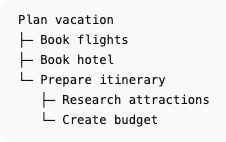

# Recurso - Hierarchical Task Manager

[Live Demo](https://task-manager-frontend-qzyl.onrender.com/) (may take a few seconds to start)

 

A task management application that enables users to organize tasks in unlimited nested hierarchies using a recursive tree structure. The hierarchy is visualized through dynamic font sizing, where parent tasks are displayed with larger text than their children.

 

## Functionality
Clicking a task toggles its status between **completed** (~~strikethrough~~) and **pending**.

**+ Add New Item**: adds a new top-level task at the bottom of the list

**- Reset List**: deletes all tasks and adds a placeholder task

### Action Buttons


Hovering over a task summons the **Action Bar**, a set of buttons for performing the following actions:

* **Highlight**: highlight the current task

* **Drag and Drop**: move the current task, including any child tasks

* **Edit**: edit the current task

* **Add Sibling Task**: add a new sibling task below the current task

* **Add Child Task**: add a new child task to the current task

* **Delete**: delete the current task, including any child tasks

## Implementation

### Backend
Express server exposing a REST API for user authentication and task CRUD operations.
Authentication is handled using session-based auth with cookies stored via express-session and persisted in a PostgreSQL database.

The API is deployed as a Web Service on Render and connected to a Neon-hosted PostgreSQL database.

It also handles cross-origin requests from the frontend using CORS configuration.

### Frontend
React client responsible for rendering the task tree and managing the user interface.

Tasks are rendered recursively to support unlimited nesting, with each task component responsible for rendering its children.

Communicates with the backend API using fetch with cookie-based authentication enabled.

Deployed as a static site on Render.

## How to Run
The monorepo contains the database, server (**/backend**) and client (**/frontend-vite**). From the repo root they can be started locally in the following ways:

### Database (Docker)
```
Start: docker compose up -d
Stop: docker compose down -v (removes volume)
```

### Server
```
cd /backend
npm install
node app.js
```

### Client
```
cd /frontend-vite
npm install

Run Dev: npm start
Build: npm run build
```
