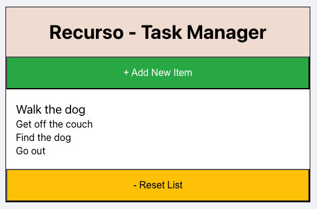

# Recurso - Hierarchical Task Manager

 

<!-- 
<p align="center">
  
</p>
-->

Task management app focused on organizing tasks into parent-child relationships. This chain is technically endless and the different levels are visually separated using font size, with tasks on the lowest level having the smallest font size. From there the font size then increases incrementally for each level, so that top-level tasks always have the biggest font size.

## Functionality
Clicking a task toggles its status between **completed** (strikethrough) and **pending**.

**+ Add New Item**: adds a new top-level task at the bottom of the list

**- Reset List**: deletes all tasks and adds a placeholder task

### Action Buttons


These appear on the right when hovering over a task and support the following functionality:

* **Drag and Drop**: move the current task, including any child tasks

* **Edit**: edit the current task

* **Add Sibling Task**: add a new sibling task below the current task

* **Add Child Task**: add a new child task to the current task

* **Delete**: delete the current task, including any child tasks

## How to Run

### Server
```
cd /backend
npm install
node app.js
```

### Client
```
cd /frontend
npm install
npm start
```
